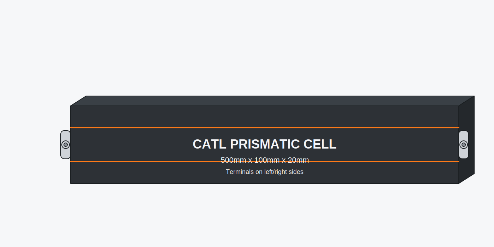
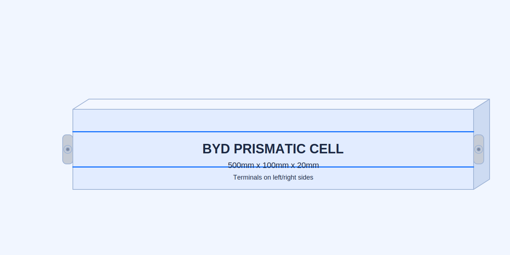
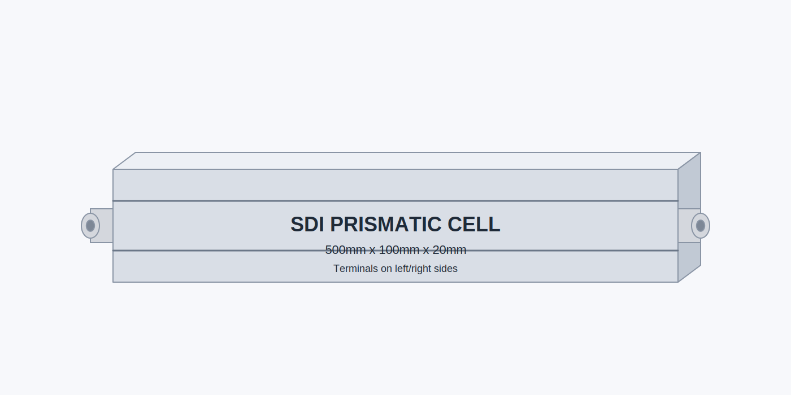

# Prismatic cell 3D images

This repo generates simple 3D-styled SVG renders of prismatic battery cells (500mm x 100mm x 20mm) with terminals on the left and right sides, inspired by CATL, BYD, and SDI product visuals.

## Preview

## Deploy

Static hosting: the repo includes `index.html` that references the SVG assets. Deploy by hosting the repository root on any static host (GitHub Pages, Netlify, S3, etc.).

Streamlit hosting: run `streamlit run app.py` (requires the dependency in `requirements.txt`).

## Regenerate images

Run the generator script:

python3 scripts/generate_prismatic_cells.py
